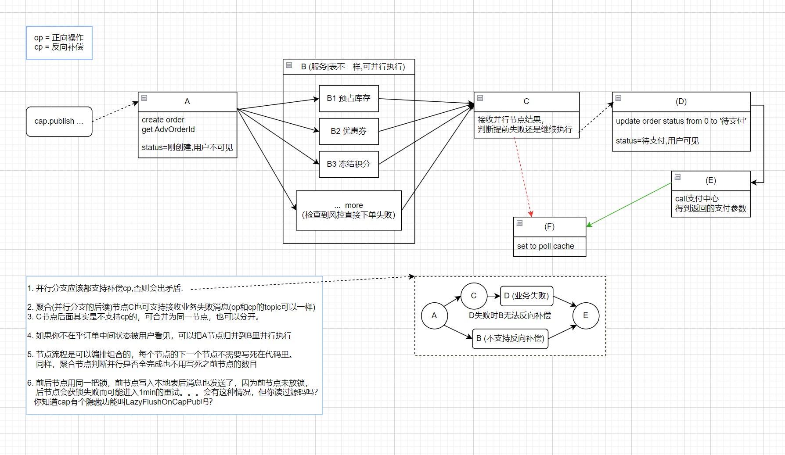
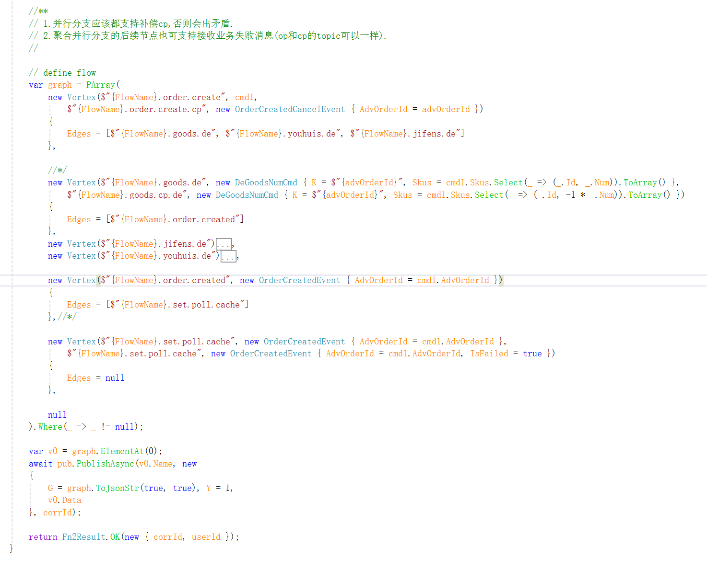
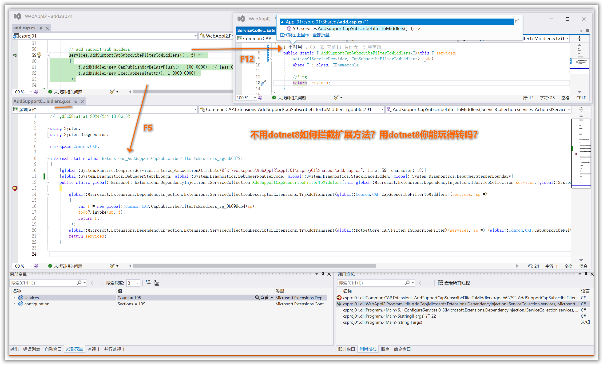
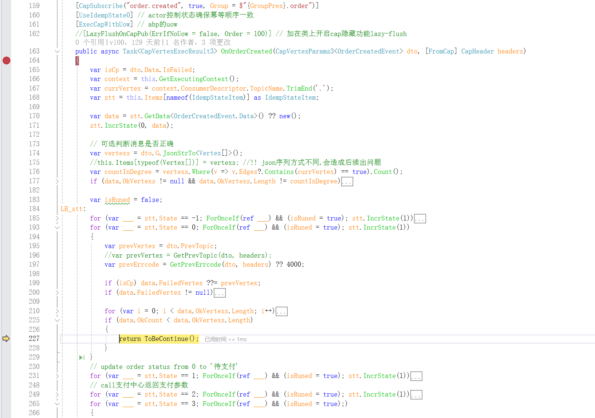

## Common.CAP 实现分布式saga(事务)流程

* 原理图

- 流程定义

- 启动

* 单独某个节点

是否用锁还是数据库事务+唯一索引，自己决定！还可以通过自定义参数和结果，接收前节点的结果和发送本节点结果到下一节点。

* 聚合节点

聚合节点怎么知道之前有多少个并行节点，以及给个节点的结果，这些不会写死的。可以通过自定义参数和中间件解决。

# 本地表记录结果：
- 成功

- 失败

