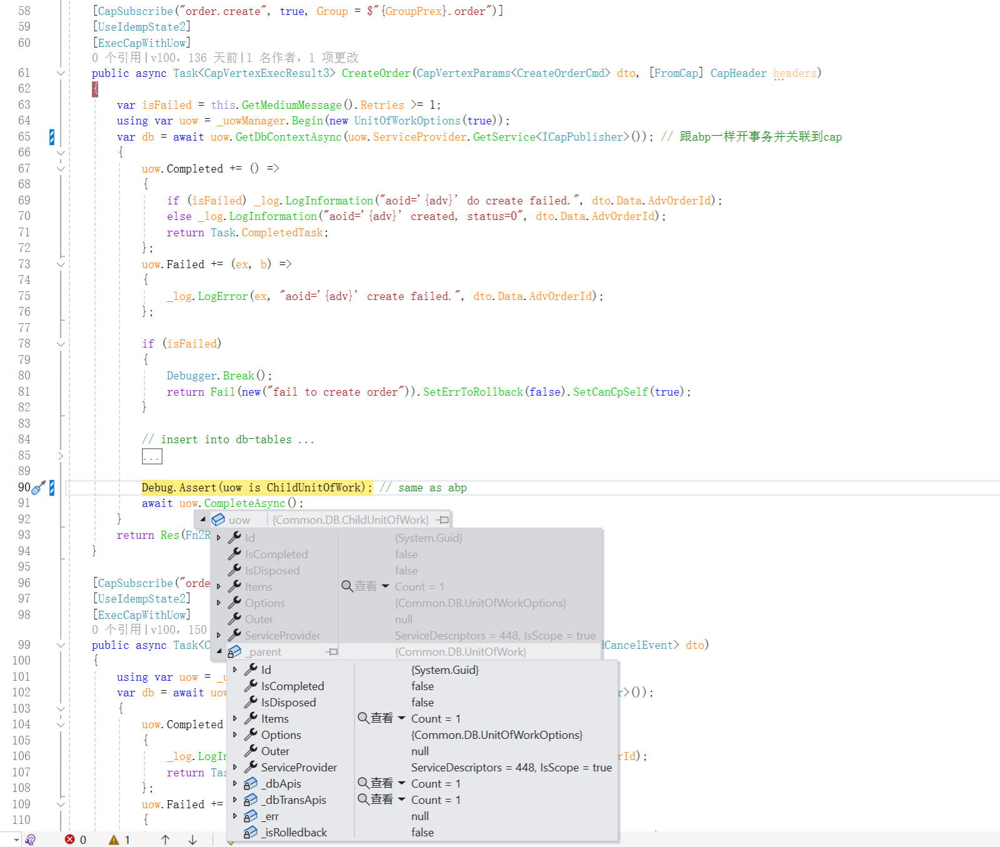

## Common.CAP 实现分布式saga(事务)流程

当你有需要的时候，可以使用 Common.CAP 实现分布式saga(事务)流程。。。

* 原理图


* 流程定义


* 启动


* 单独某个节点

是否用锁还是数据库事务+唯一索引，自己决定！还可以通过自定义参数和结果，接收前节点的结果和发送本节点结果到下一节点。



* 聚合节点

聚合节点怎么知道之前有多少个并行节点，以及各个节点的结果，这些不会写死的。可以通过自定义参数和自定义结果解决。<br>
参考 ```CapVertexParams<T>``` 和 ```IExecCapResult```


# 本地表记录业务结果

- 成功

- 失败


