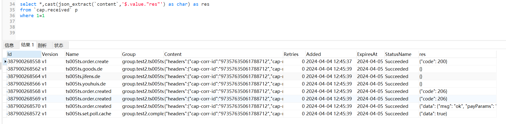

## 实现简单的状态和结果保存

cap的订阅方法每次执行完都会更新本地表的该行记录。在不是那么严谨的情况下，可以实现简单的状态和结果保存，最后会随cap框架自身保存到Value中。

# how to run
1. cd `本库根目录`
2. cd Sample3 && dotnet build
3. cd .. && 运行 ./rg.cap.bat 生成
4. cd Sample3 && dotnet run

# 本地表记录业务结果

- 成功

- 失败

